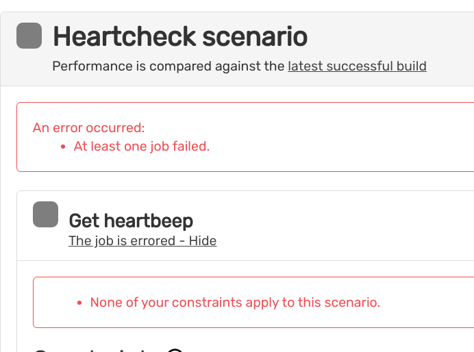

# BLACKFIRE
set BLACKFIRE CREDENTIAL in docker-compose.yml

```yaml
blackfire:
    image: blackfire/blackfire
    environment:
	  ...
      BLACKFIRE_SERVER_ID: xxxxxxxxxxxx
      BLACKFIRE_SERVER_TOKEN: xxxxxxxxxxxxxxxxxxxx
      BLACKFIRE_CLIENT_ID: xxxxxxxxxxxxxxxxxx
      BLACKFIRE_CLIENT_TOKEN: xxxxxxxxxxxxxxxxx
```

```yaml
user:
    ...
    environment:
      BLACKFIRE_CLIENT_ID: xxxxxxxxxxxxxxxxx
      BLACKFIRE_CLIENT_TOKEN: xxxxxxxxxxxxxxxx
   
```

## Start project

```bash
docker-compose up -d
```

```bash
docker-compose exec user bash
```

```bash
composer install
composer server:start:dev
composer behatbf

```

return value like

```bash
> ./vendor/bin/behat --suite=blackfire --format=progress -o std -f junit -o test_results
.........

1 scenario (1 passed)
9 steps (9 passed)
0m21.09s (4.86Mb)
```

The web blackfire

