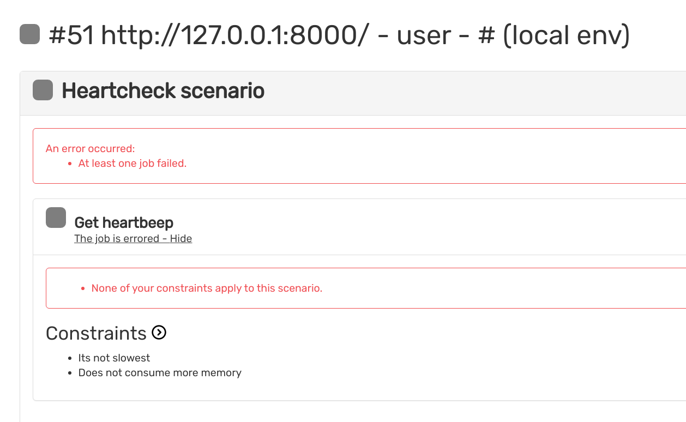

# BLACKFIRE
BLACKFIRE CONFIG 
installation and configuration according to the web 
https://blackfire.io/docs/up-and-running/installation
## Start project


```bash
cd framework/
composer install
symfony server:start
vendor/bin/behat --suite=blackfire

```

return value like

```bash
1 scenario (1 passed)
9 steps (9 passed)
0m9.97s (14.37Mb)
```

The web blackfire

